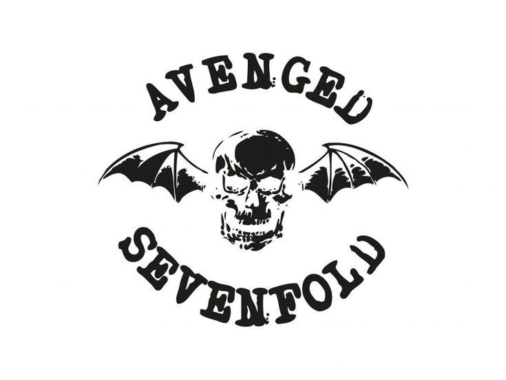

# 💫 About Me:

# 👋 Hello World!, I’m Welsa Arya Darma    🎓 I’m an undergraduate student at **Universitas Muhammadiyah Riau**, majoring in Informatics.   💻 Passionate about **Web Development**, especially with **Laravel, PHP, and JavaScript**.   🚀 I love learning new technologies, solving problems, and building useful applications.    ---  ## 🔧 Tech Stack - **Languages**: PHP, JavaScript, HTML, CSS   - **Frameworks**: Laravel, Bootstrap, React Js, Vite   - **Tools**: Git, VS Code, MySQL    ---  ## 📌 Current Projects - 📂 **Webabsensi** – Laravel-based web application for attendance   - 📂 **PPDB** – Online registration system with Laravel & jQuery   - 📂 **Portfolio Website** – Personal portfolio built with Laravel    ---     ---  ## 📫 How to reach me - ✉️ Email: [ariyasilangkitang@gmail.com]  --- ✨ *“Code is like humor. When you have to explain it, it’s bad.”*   
=======
# 👋 Hello World!, I’m Welsa Arya Darma    🎓 I’m an undergraduate student at **Universitas Muhammadiyah Riau**, majoring in Informatics.   💻 Passionate about **Web Development**, especially with **Laravel, PHP, and JavaScript**.   🚀 I love learning new technologies, solving problems, and building useful applications.    ---  ## 🔧 Tech Stack - **Languages**: PHP, JavaScript, HTML, CSS   - **Frameworks**: Laravel, Bootstrap, React Js, Vite   - **Tools**: Git, VS Code, MySQL    ---  ## 📌 Current Projects - 📂 **Webabsensi** – Laravel-based web application for attendance   - 📂 **PPDB** – Online registration system with Laravel & jQuery   - 📂 **Portfolio Website** – Personal portfolio built with Laravel    ---     ---  ## 📫 How to reach me - ✉️ Email: [ariyasilangkitang@gmail.com]  --- ✨ *“Code is like humor. When you have to explain it, it’s bad.”*   
>>>>>>> 741ddc226f2fc2ef23fe88bdb0b95d87e7a10a7c

## 🌐 Socials:
     

# 💻 Tech Stack:
               
# 📊 GitHub Stats:
 
 

## 🏆 GitHub Trophies

### ✍️ Random Dev Quote

### 🔝 Top Contributed Repo

---

<!-- Proudly created with GPRM ( https://gprm.itsvg.in ) -->
